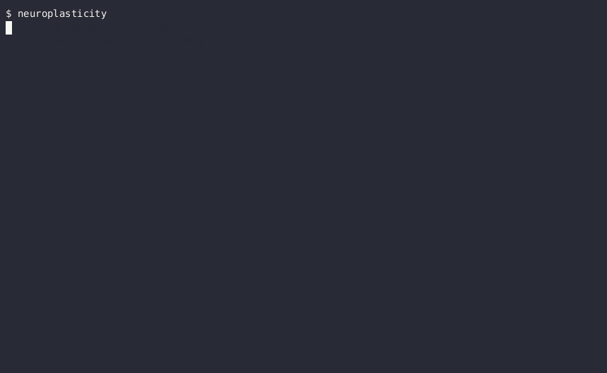

# NeuroPlasticity 🧠
**Its like a gym for your agent to self improve it's rules.**



Building reliable AI agents is currently a dark art of manual prompt-tweaking and hoping for the best. **NeuroPlasticity** ends the guesswork by introducing **Self-Reinforced Testing Framework (SRTF)** to the prompt engineering lifecycle. Built in lightning-fast Rust and fully isolated via rootless Podman sandboxes, NeuroPlasticity treats your agent's system prompt like source code that needs to be compiled. You define the deterministic tests; if your agent fails, our Meta-Optimizer analyzes the `stderr` logs, autonomously writes a behavioral patch for the agent's prompt, and re-runs the container until the tests pass. When it succeeds, it hands you a mathematically verified `neuroplasticity_patch.md` to permanently upgrade your codebase.

> *"By treating verbal feedback from deterministic environments as a reward signal, language agents can iteratively refine their behavior, correcting hallucinations and logical errors without requiring traditional weight updates."*  
> — Inspired by the architectural findings in **Reflexion: Language Agents with Verbal Reinforcement Learning** (Shinn et al., 2023) and **Large Language Models as Optimizers / OPRO** (Yang et al., Google DeepMind, 2023).

---

## 🔥 Features

*   **Automated Self-Healing:** The Meta-Optimizer dynamically patches failing agents by analyzing evaluation logs and injecting targeted behavioral constraints.
*   **100% Ephemeral Sandboxing:** Agents execute inside secure, rootless **Podman** containers with copy-on-write scratch directories. No host bleed. No broken state.
*   **Offline First via `llama.cpp`:** Run fully disconnected. Compile with `cargo run --features embedded-llm` to automatically pull and run models like `Qwen2.5-Coder` directly in your computer's memory. To respect user disk space, NeuroPlasticity does not download duplicate models. It defaults to using universally accepted POSIX model caches: `~/.cache/huggingface/hub/`, `~/.ollama/models/blobs/`, `~/.cache/lm-studio/models/`, with a fallback to `~/.cache/neuro/models/`.
*   **Declarative `plasticity.json`:** Define your tasks, sandbox constraints, and deterministic `bash` evaluators in a strict, schema-backed JSON manifest.
*   **Verified Improvement Patches:** If the framework successfully optimizes an agent, it generates a `neuroplasticity_patch.md` detailing the exact prompt overrides needed to fix the agent permanently.

## ⚡ How It Works

1.  **Define the Test:** You write a `plasticity.json` stating what the agent *should* do, and write a simple bash script to evaluate if it did it.
2.  **The Failure (Epoch 1):** The orchestrator spins up the agent in a Podman container. The agent fails the test.
3.  **The Meta-Optimization:** NeuroPlasticity extracts the failure logs (`stderr` / `stdout`) and passes them to the LLM Meta-Optimizer. The LLM writes a specific, targeted rule to fix the agent's mistake.
4.  **The Fix (Epoch 2):** NeuroPlasticity injects the new rule into `.neuroplasticity/rules.json`, boots a fresh container, and runs the agent again.
5.  **The Patch:** Once the evaluators pass, NeuroPlasticity generates a final `neuroplasticity_patch.md`. You hand this patch to your primary dev-agent (like Claude or Aider) to permanently update your target project.

## 🚀 Quick Start (Zero-Dependency Sandbox Test)

We've included a self-test configuration in the root directory that demonstrates exactly how the Meta-Optimizer reacts to failure. You can run this immediately after cloning.

Ensure you have [Podman](https://podman.io/) installed.

**1. Clone the repository and build the base container:**
```bash
git clone https://github.com/Cognilogical/NeuroPlasticity.git
cd neuroplasticity

# Build the dummy container testbed
./images/build.sh
```

**2. Review the dummy test (`plasticity.json`):**
In this dummy test, we intentionally break an agent by forcing it to output `{"wrong": 1}` instead of what the prompt asks for (`{"greeting": "world"}`).
```json
{
  "name": "neuroplasticity-self-test",
  "task_prompt": "Write a JSON file named hello.json containing the key 'greeting' with the value 'world'.",
  "agent_command": ["bash", "-c", "echo '{\"wrong\": 1}' > hello.json"],
  "sandbox": {
    "engine": "podman",
    "base_image": "localhost/neuro-agent-testbed:latest"
  },
  "evaluators": [
    {
      "name": "Check JSON Output",
      "script": ["bash", "-c", "jq -e '.greeting == \"world\"' hello.json"],
      "weight": 1.0
    }
  ],
  "optimization": {
    "target_rules_file": ".neuroplasticity/rules.json",
    "epochs": 2,
    "pass_threshold": 1.0,
    "meta_llm": {
      "provider": "embedded",
      "model": "qwen-local"
    }
  }
}
```

**3. Run the CLI tool (with embedded local inference):**
No API keys required. The embedded `llama.cpp` engine will automatically download a fast 4-bit `Qwen2.5` model to your local cache.
```bash
cargo run --features embedded-llm
```

**4. Watch the Magic Happen:**
* **Epoch 1:** The script fails. The evaluator triggers an error.
* **Meta-Optimization:** Your local GPU spins up, reads the `jq` failure log, and generates a new rule (e.g. *"Rule: Ensure the JSON file hello.json is created with the key 'greeting'"*).
* **The Overlay:** The orchestrator drops the generated fix into `.neuroplasticity/rules.json`.

*(Note: Because our dummy `agent_command` is just a hardcoded `echo` and doesn't read the `rules.json` file, Epoch 2 will fail again by design! But it perfectly demonstrates the feedback loop!)*

---

## 🎯 Real-World Example: Fixing a Prompts File (`agent.md`)

Let's say you have a data-extraction agent. Its behavior is defined entirely by a markdown prompt file called **`agent.md`**. You've noticed a frustrating bug: when the agent extracts data to a `.json` file, it keeps wrapping the output in markdown code blocks (` ```json ... ``` `), which breaks your automated `jq` parsers.

Instead of endlessly tweaking `agent.md` and guessing, you can use NeuroPlasticity to mathematically force the agent to figure out the fix itself.

**1. Write your `plasticity.json`:**
```json
{
  "$schema": "https://raw.githubusercontent.com/Cognilogical/NeuroPlasticity/main/schemas/v1/plasticity.schema.json",
  "name": "json-formatting-eval",
  "task_prompt": "Read the access logs and output a summary to summary.json.",
  "agent_command": ["my-agent-cli", "--system-prompt", "agent.md"],
  "sandbox": {
    "engine": "podman",
    "base_image": "localhost/my-agent-testbed:latest"
  },
  "optimization": {
    "target_rules_file": ".neuroplasticity/rules.json",
    "epochs": 3,
    "pass_threshold": 1.0,
    "meta_llm": {
      "provider": "embedded",
      "model": "qwen-local"
    }
  },
  "evaluators": [
    {
      "name": "Strict JSON Check",
      "script": ["bash", "-c", "jq . summary.json || (echo 'Output is not valid JSON! Did you use markdown blocks?' >&2; exit 1)"],
      "weight": 1.0
    }
  ]
}
```

**2. Run the Test!**
```bash
neuroplasticity
```

### What Happens:
*   **Epoch 1:** NeuroPlasticity runs your agent in the sandbox using your current `agent.md`. The agent writes the file, but includes the markdown backticks. `jq` fails with a parse error.
*   **The Meta-Optimizer:** Your local embedded LLM reads the `jq` failure log. It autonomously writes a new system rule: *"CRITICAL: When outputting JSON to a file, DO NOT wrap the output in markdown code blocks (\`\`\`json). You must output raw JSON text only."* It saves this to `.neuroplasticity/rules.json`.
*   **Epoch 2:** The agent runs again. *Because your agent framework is set up to append `.neuroplasticity/rules.json` to `agent.md` during tests*, the agent now knows exactly what to avoid. It outputs raw JSON. The `jq` evaluator passes!
*   **The Patch:** NeuroPlasticity outputs `neuroplasticity_patch.md`. You simply copy that mathematically verified rule and paste it permanently into your `agent.md` file.

### 1. Baking in Dependencies (MCP Servers & Tools)
Because NeuroPlasticity treats your agent as a **black box**, your agent's environment needs to match reality. If your agent relies on external tools like `sqlite`, a Python environment, or an MCP (Model Context Protocol) server, you must provide them in the sandbox.

**The Solution:** Build a custom `Containerfile` or `Dockerfile` that installs your dependencies and starts any necessary background services (like an MCP router). Then point your `plasticity.json` to that image.

```json
"sandbox": {
  "engine": "podman",
  "base_image": "localhost/my-agent-with-mcp-testbed:latest"
}
```

*Pro-Tip for MCP:* If your agent fails because it hallucinates data instead of using an MCP tool, ensure your evaluator's error message explicitly names the tool. (e.g., `echo 'Agent hallucinated! It MUST use the postgres-mcp read_query tool.' >&2`). The Meta-Optimizer will read this and explicitly write a rule enforcing the tool's use.

### 2. Chained Evaluators & Preventing Regressions
As your agent gets more complex, fixing one bug might introduce another. NeuroPlasticity supports **Chained Evaluators** to prevent regressions. You can define multiple independent tests in your `plasticity.json`. 

The Meta-Optimizer must find a system prompt that satisfies *all* evaluators simultaneously to achieve a `pass_threshold` of 1.0.

```json
"evaluators": [
  {
    "name": "Check JSON Format",
    "script": ["bash", "-c", "jq . output.json || (echo 'Must be valid JSON!' >&2; exit 1)"],
    "weight": 0.5
  },
  {
    "name": "Check For Markdown Code Blocks",
    "script": ["bash", "-c", "! grep -q '```' output.json || (echo 'No markdown code blocks allowed!' >&2; exit 1)"],
    "weight": 0.5
  },
  {
    "name": "Check Schema",
    "script": ["bash", "-c", "jq -e '.status == \"success\"' output.json || (echo 'Missing status field!' >&2; exit 1)"],
    "weight": 1.0
  }
]
```
If the agent fixes the markdown bug but suddenly breaks the schema, the overall run fails, and the Meta-Optimizer will attempt a new prompt that addresses both constraints until it finds the perfect balance.

> **🤯 META PRO-TIP:** Don't want to write these JSON tests and bash evaluators manually? Just point your primary dev-agent (like Claude, Aider, or this CLI) at this `README.md` and tell it: *"Read this framework's documentation, then write a `plasticity.json` test suite to evaluate and improve your own performance on [Task X]."* Let the agent build its own gym!

## 🛠️ Configuration (`plasticity.json`)

```json
{
  "$schema": "https://raw.githubusercontent.com/Cognilogical/NeuroPlasticity/main/schemas/v1/plasticity.schema.json",
  "name": "my-agent-eval",
  "task_prompt": "Update the database schema.",
  "agent_command": ["./run_my_agent.sh"],
  "sandbox": {
    "engine": "podman",
    "base_image": "localhost/my-agent-testbed:latest"
  },
  "optimization": {
    "target_rules_file": ".neuroplasticity/rules.json",
    "epochs": 3,
    "pass_threshold": 1.0,
    "meta_llm": {
      "provider": "embedded",
      "model": "qwen-local"
    }
  },
  "evaluators": [
    {
      "name": "Check Schema Creation",
      "script": ["bash", "-c", "test -f schema.sql"],
      "weight": 1.0
    }
  ]
}
```
