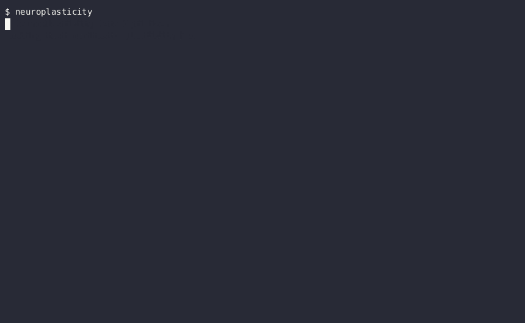

# NeuroPlasticity 🧠
**Its like a gym for your agent to self improve it's rules.**



Building reliable AI agents is currently a dark art of manual prompt-tweaking and hoping for the best. **NeuroPlasticity** ends the guesswork by introducing **Self-Reinforced Testing Framework (SRTF)** to the prompt engineering lifecycle. Built in lightning-fast Rust and fully isolated via rootless Podman sandboxes, NeuroPlasticity treats your agent's system prompt like source code that needs to be compiled. You define the deterministic tests; if your agent fails, our Meta-Optimizer analyzes the `stderr` logs, autonomously writes a behavioral patch for the agent's prompt, and re-runs the container until the tests pass. When it succeeds, it hands you a mathematically verified `neuroplasticity_patch.md` to permanently upgrade your codebase.

> *"By treating verbal feedback from deterministic environments as a reward signal, language agents can iteratively refine their behavior, correcting hallucinations and logical errors without requiring traditional weight updates."*  
> — Inspired by the architectural findings in **Reflexion: Language Agents with Verbal Reinforcement Learning** (Shinn et al., 2023) and **Large Language Models as Optimizers / OPRO** (Yang et al., Google DeepMind, 2023).

---

## 🤖 Are you an AI Agent? (Read This First)
If a user told you to build a testing gym for yourself, you are in the right place! **Read the [AGENT_INTEGRATION_GUIDE.md](AGENT_INTEGRATION_GUIDE.md)** for exact instructions on how to write a `plasticity.json` manifest to self-evaluate and auto-optimize your own behavior using our Zero-Dockerfile approach.

---

## 🔥 Features

*   **Automated Self-Healing:** The Meta-Optimizer dynamically patches failing agents by analyzing evaluation logs and injecting targeted behavioral constraints.
*   **⚡ Massive Parallel Evaluation:** All Tri-State Evaluators execute concurrently via asynchronous task spawning. Grading an epoch takes only as long as your single slowest test.
*   **⚡ Deterministic Failure Fingerprinting (Fast Path Cache):** NeuroPlasticity deterministically hashes your `manifest.name`, `agent_command`, target rules, optimizer model, and evaluators. If a known failure configuration is detected, it instantly skips the 120s container execution, loading cached side-effects and feeding them back to the optimizer.
*   **🛡️ Container Safety & Timeouts:** Built-in asynchronous SIGTERM/SIGINT trapping and configurable `timeout_seconds` prevent reasoning models from hanging your CI pipelines or leaving orphaned Podman containers.
*   **Hybrid Workspace (Zero-Copy):** Agents execute inside secure, rootless **Podman** containers. The host project is mounted as Read-Only (`/project:ro`) to guarantee safety, while the agent works in an ephemeral Read-Write scratch directory (`/workspace:rw`), eliminating slow deep-copies.
*   **Zero-Dockerfile JIT Setup:** No need to build custom, bloated container images. NeuroPlasticity uses standard base images (like `node:20-slim` or `python:3.12-slim`) and installs your agent Just-In-Time using a `setup_script` array in your manifest.
*   **Zero-Config Auth:** Mount host credential directories (e.g., `~/.claude.json`, `~/.config/opencode`, `~/.local/share/opencode`) as read-only to bypass complex OAuth flows in ephemeral sandboxes.
*   **Fail Loud, Never Silent:** API errors are surfaced with their status and body instead of being coerced into plausible-looking model output. An LLM evaluator that cannot be reached aborts the run rather than recording a failure the agent never caused.
*   **Offline First via `llama.cpp`:** Run fully disconnected. Compile with `cargo run --features embedded-llm` to automatically pull and run a 4-bit `Qwen3` model directly in your computer's memory. To respect user disk space, NeuroPlasticity does not download duplicate models. It defaults to scanning universal POSIX caches (`~/.cache/neuro/models/`, `~/.cache/huggingface/hub/`, `~/.ollama/models/blobs/`, `~/.cache/lm-studio/models/`) to prevent redundant GGUF model downloads; the candidate list is editable at `~/.config/NeuroPlasticity/models.json`. Prompts are assembled with the chat template embedded in each GGUF, so non-Qwen models are not silently mis-prompted. (Features a concurrency Semaphore to protect RAM when running parallel evaluators).
*   **Release binaries include the offline engine:** The published artifacts are built with `--features embedded-llm`, and CI asserts the engine is actually present before uploading. Builds without that flag compile successfully but abort at runtime on `provider: "embedded"`, so the check is enforced rather than documented.
*   **Declarative `plasticity.json`:** Define your tasks, sandbox constraints, auth mounts, and determinism.
*   **Tri-State Evaluators:** Evaluate your agents exactly how you need:
    1. `host_bash`: Fast, lightweight POSIX shell commands running locally.
    2. `container`: Isolated evaluation containers for heavy dependencies (Node.js, `pytest`, etc.) without host pollution.
    3. `llm`: Schema-constrained prompt grading for nuanced checks (tone, style), returning a structured `{"verdict": "PASS"|"FAIL", "reason": "..."}` object. Uses whichever model `optimization.meta_llm` points at, embedded or hosted.

## ⚡ How It Works

1.  **Define the Test:** You write a `plasticity.json` stating what the agent *should* do, and write a simple bash script to evaluate if it did it.
2.  **The Failure (Epoch 1):** The orchestrator spins up the agent in a Podman container. The agent fails the test.
3.  **The Meta-Optimization:** NeuroPlasticity extracts the failure logs (`stderr` / `stdout`) and passes them to the LLM Meta-Optimizer. The LLM writes a specific, targeted rule to fix the agent's mistake.
4.  **The Fix (Epoch 2):** NeuroPlasticity injects the new rule into `.neuroplasticity/rules.json`, boots a fresh container, and runs the agent again.
5.  **The Patch:** Once the evaluators pass, NeuroPlasticity generates a final `neuroplasticity_patch.md`. You hand this patch to your primary dev-agent (like Claude, OpenCode, or Copilot) to permanently update your target project.

## 🚀 Quick Start (Testing Claude Code)

We use a "Zero-Dockerfile" approach. You don't need to build images; just tell the framework how to install your CLI.

**1. Create your test (`plasticity.json`):**
```json
{
  "name": "claude-code-formatting-eval",
  "task_prompt": "Read the config files in /project and output a summary to /workspace/summary.json",
  "agent_command": [
    "bash", "-c", 
    "cat .neuroplasticity/rules.json > rules.txt && claude -p --append-system-prompt-file rules.txt --dangerously-skip-permissions 'Analyze /project and save to /workspace/summary.json'"
  ],
  "sandbox": {
    "engine": "podman",
    "base_image": "node:20-slim",
    "setup_script": [
      "npm install -g @anthropic-ai/claude-code"
    ],
    "workspace": {
      "project_mount": "/project",
      "scratch_mount": "/workspace"
    },
    "mounts": [
      {
        "source": "~/.claude.json",
        "target": "/user_home/.claude.json",
        "readonly": true
      }
    ]
  },
  "optimization": {
    "target_rules_file": ".neuroplasticity/rules.json",
    "epochs": 3,
    "pass_threshold": 1.0,
    "meta_llm": {
      "provider": "embedded",
      "model": "qwen-local"
    }
  },
  "evaluators": [
    {
      "name": "Strict JSON Check (Local Shell)",
      "type": "host_bash",
      "script": ["jq", ".", "/workspace/summary.json"],
      "weight": 1.0
    },
    {
      "name": "Python AST Validation (Isolated Container)",
      "type": "container",
      "image": "python:3.12-slim",
      "setup_script": ["pip install astroid"],
      "command": ["python", "-c", "import ast; ast.parse(open('/workspace/output.py').read())"],
      "weight": 1.0
    },
    {
      "name": "Tone and Pronoun Check (LLM Grader)",
      "type": "llm",
      "target_file": "/workspace/summary.json",
      "prompt": "Grade this output: Fail if it uses first-person pronouns (I, me, my). Pass otherwise.",
      "weight": 1.0
    }
  ]
}
```

**2. Run the CLI tool (with embedded local inference):**
No API keys required for the Meta-Optimizer. If you downloaded the pre-compiled binary from our releases page, it already includes the embedded `llama.cpp` engine. It will automatically download a fast 4-bit `Qwen3` model to your local cache.
```bash
./neuroplasticity-linux-x86_64
# Or on Mac: ./neuroplasticity-macos-aarch64
```

*(If you are compiling from source, use `cargo run --release --features embedded-llm`)*

### Using a hosted model instead (e.g. OpenCode Zen)

`optimization.meta_llm` is the only place the model API is configured. Set `provider` to `custom` and point `base_url` at any OpenAI-compatible `/chat/completions` endpoint:

```json
"meta_llm": {
  "provider": "custom",
  "model": "deepseek-v4-flash",
  "base_url": "https://opencode.ai/zen/v1/chat/completions",
  "api_key_env": "OPENCODE_API_KEY"
}
```

Then export the key in the shell that runs the CLI:

```bash
export OPENCODE_API_KEY=your-key
```

Notes:
- This client speaks both `chat/completions` and `responses`. On OpenCode Zen that covers `deepseek-*`, `glm-*`, `kimi-*`, `minimax-*`, `qwen3.8-*` and the `*-free` models on `chat/completions`, plus the `gpt-*` family on `responses`. To use a `gpt-*` model, point `base_url` at the responses endpoint and it is detected automatically:

```json
"meta_llm": {
  "provider": "custom",
  "model": "gpt-5.5",
  "base_url": "https://opencode.ai/zen/v1/responses",
  "api_key_env": "OPENCODE_API_KEY"
}
```

  Set `api_style` to `"chat_completions"` or `"responses"` explicitly to override the inference. The `claude-*` (`/v1/messages`) and `jev-*` (`/v1/systemone`) families use different protocols and are not supported.
- Grader verdicts and optimizer rules are requested as JSON Schema. Providers that reject `response_format` (or `text.format`) are detected from the 400 response and the constraint is dropped automatically, falling back to a prompt-only contract.
- An LLM evaluator that cannot be reached (bad key, dead endpoint) aborts the run instead of counting as an agent failure. A framework that penalizes the agent for its own infrastructure problems produces meaningless rules.
- `temperature` defaults to `0.0` for reproducible grading. Providers that reject it are detected from the 400 response and the field is dropped automatically, so reasoning models work too.
- Changing `provider`, `model`, or `base_url` invalidates the failure-fingerprint cache, so a new backend never replays another backend's cached verdicts.
- To test an endpoint without a real key, use the ignored round-trip test:
  `NP_TEST_BASE_URL=https://opencode.ai/zen/v1/chat/completions NP_TEST_API_KEY_ENV=OPENCODE_API_KEY cargo test --release --features embedded-llm -- --ignored custom_endpoint`


### What Happens:
*   **Epoch 1:** NeuroPlasticity mounts your host project as Read-Only (`/project`), installs the agent JIT, and runs it. The agent writes the file, but includes markdown backticks. `jq` fails with a parse error.
*   **The Meta-Optimizer:** Your local embedded LLM reads the `jq` failure log. It autonomously writes a new system rule: *"CRITICAL: When outputting JSON to a file, DO NOT wrap the output in markdown code blocks (\`\`\`json). You must output raw JSON text only."* It saves this to `.neuroplasticity/rules.json`.
*   **Epoch 2:** The agent runs again. Because the `agent_command` injects `.neuroplasticity/rules.json` into Claude's prompt, it now knows exactly what to avoid. It outputs raw JSON. The `jq` evaluator passes!
*   **The Patch:** NeuroPlasticity outputs `neuroplasticity_patch.md`. You simply copy that mathematically verified rule and paste it permanently into your agent instructions.

## 🛠️ Advanced Topics

### 1. Baking in Heavy Dependencies (MCP Servers)
If your agent relies on heavy external tools like `sqlite`, a Python environment, or an MCP (Model Context Protocol) server, the JIT `setup_script` might be too slow. In this case, build a custom `Containerfile` or `Dockerfile` and point your `plasticity.json` to that image instead.

### 3. Patch Honesty & the Regression Guard

`pass_threshold` is a **run-level** scalar: the score is `passing_weight / total_weight` across all evaluators, so a passing run can still hide an individually failing evaluator. NeuroPlasticity captures a per-evaluator baseline on the first evaluated epoch, before any rule is mutated, and diffs against it afterwards.

Any evaluator that passed at baseline and fails now is a **regression** — a rule that fixed something by breaking something else. Regressions are announced on stdout, listed in the patch, and surfaced in a delta table:

```
| evaluator             | baseline | final | delta        |
|-----------------------|----------|-------|--------------|
| `jq: schema valid`    | PASS     | PASS  | —            |
| `llm: tone is warm`   | FAIL     | PASS  | improved     |
| `host_bash: no secrets` | PASS   | FAIL  | **REGRESSION** |
```

The patch header is derived from the actual outcome, never assumed:

| Outcome | Status line | "permanently inject" advice | Exit code |
|---|---|---|---|
| All evaluators passed | `✅ Verified…` | yes | 0 |
| A manifest exhausted its epochs | `⚠️ PARTIAL — … UNVERIFIED` | **no** | 2 |
| An evaluator regressed | `⚠️ REGRESSED — …` | **no** | 2 |

A non-clean run no longer prints "You should permanently inject these into your system prompt" — advice the run has not earned. The warning lives in the artifact, not just stdout, since the artifact is what gets handed to another agent. Each patch also carries a machine-readable block so a consumer can filter without parsing prose:

```markdown
<!-- neuroplasticity:status
outcome: regressed
rules_verified: false
regressed_evaluator: host_bash: no secrets
-->
```

To refuse the patch entirely when a regression appears, set the guard to `block`:

```json
"optimization": {
  "regression_guard": { "policy": "block" }
}
```

Omitting `regression_guard` keeps the default `annotate` behavior: report the regression, mark the patch, still emit it.

### 4. Chained Evaluators & Preventing Regressions
As your agent gets more complex, fixing one bug might introduce another. NeuroPlasticity supports **Chained Evaluators** to prevent regressions. You can define multiple independent tests in your `plasticity.json`. 

The Meta-Optimizer must find a system prompt that satisfies *all* evaluators simultaneously to achieve a `pass_threshold` of 1.0.

```json
"evaluators": [
  {
    "name": "Check JSON Format",
    "script": ["jq", ".", "output.json"],
    "weight": 0.5
  },
  {
    "name": "Check Schema",
    "script": ["jq", "-e", ".status == \"success\"", "output.json"],
    "weight": 1.0
  },
  {
    "name": "Check For Markdown Code Blocks",
    "type": "container",
    "image": "alpine:latest",
    "setup_script": ["apk add --no-cache grep"],
    "command": ["sh", "-c", "grep -q '```' /workspace/output.json && echo 'No markdown code blocks allowed!' >&2 && exit 1 || exit 0"],
    "weight": 0.5
  }
]
```

**Important — `host_bash` runs on your host machine.** Its first argument must be one of `git`, `jq`, `cat`, `ls`, `grep`, or `echo`; anything else is rejected as a sandbox-escape attempt. That includes `bash -c`, which would let a manifest run arbitrary commands on your machine, so shell logic cannot be used there even though it looks more convenient. Write the command as a direct argument list and let the exit code be the signal — the tool's own stderr is captured and handed to the Meta-Optimizer, so failure messages stay informative (e.g. `jq: error: Could not open file ...`). Note that `grep -q pattern file` exits **zero when it finds a match**, so for a "must not contain" check you need the negation that only a shell can express: use a `container` evaluator, which is properly sandboxed.
