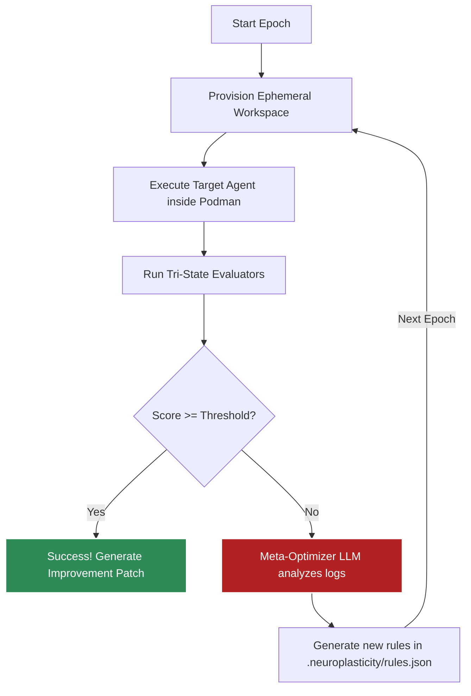
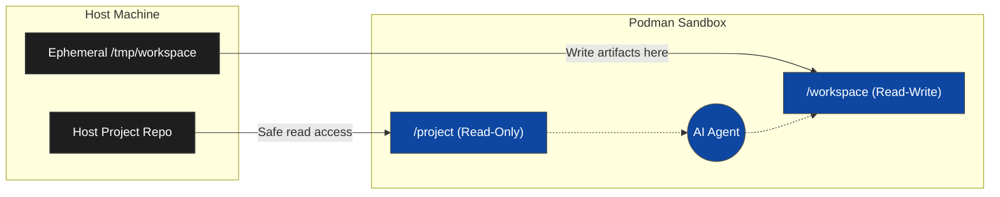
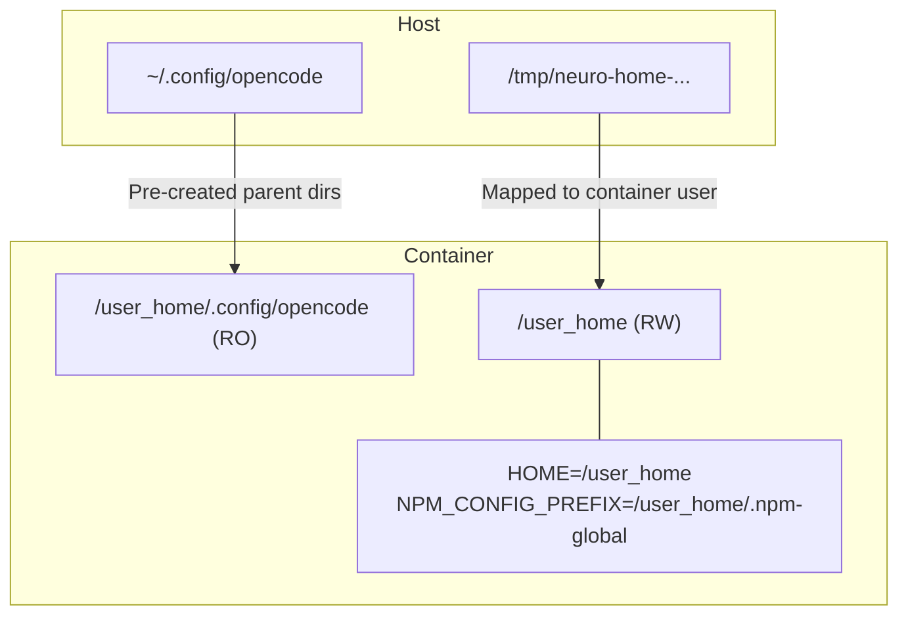

# NeuroPlasticity Architecture

NeuroPlasticity is a highly isolated, self-healing testing environment for AI CLI agents. Its architecture is designed to securely sandbox agent execution, evaluate the results deterministically (or probabilistically via LLMs), and automatically mutate the agent's prompt to fix failures in subsequent epochs.

---

## 1. The Meta-Optimization Loop

At the core of NeuroPlasticity is the evaluation and optimization loop. If an agent fails to accomplish its task, the orchestrator feeds the `stderr` and evaluation results to an embedded Meta-Optimizer LLM (e.g., Qwen2.5-Coder). The LLM generates behavioral constraints that are injected into the agent's context for the next run.



---

## 2. Hybrid Workspace (Zero-Copy Architecture)

Historically, testing agents required deep-copying the entire host repository to prevent accidental corruption. This was prohibitively slow for large codebases. NeuroPlasticity v3 introduces the **Hybrid Workspace**.

Instead of copying files, the host repository is mounted into the container as **Read-Only**. The agent is provided a separate, ephemeral scratch directory mounted as **Read-Write**.



**Benefits:**
*   **Absolute Host Safety:** The agent physically cannot delete or corrupt the user's host codebase.
*   **Instant Boot:** Zero file copying means the sandbox boots in milliseconds.

---

## 3. Zero-Config Auth & UID Sandboxing

Agents like `opencode` and `claude-code` require OAuth tokens to communicate with their LLM providers. Instead of forcing users to implement complex headless OAuth flows inside the sandbox, NeuroPlasticity uses **Zero-Config Auth**.

Host configuration directories (like `~/.config/opencode`) are mounted as Read-Only into the container. However, mapping UIDs via Podman's `--userns=keep-id` can cause `EACCES` permission errors when agents try to write to their home directory (e.g., `npm install -g`). 

To solve this, NeuroPlasticity dynamically injects an ephemeral `/user_home` directory.



---

## 4. Zero-Dockerfile JIT Setup

To avoid maintaining dozens of custom Dockerfiles for different agents, NeuroPlasticity uses standard, minimalistic base images (e.g., `node:20-slim` or `python:3.12-slim`). 

The agent is installed Just-In-Time (JIT) using the `setup_script` array in the `plasticity.json` manifest.

```json
"sandbox": {
  "engine": "podman",
  "base_image": "node:20-slim",
  "setup_script": [
    "npm install -g cspell",
    "chmod +x /usr/local/bin/opencode"
  ]
}
```
The Rust orchestrator dynamically compiles this array into a safe, single-line shell command joined with the `agent_command`, completely eliminating the need for Dockerfiles.

---

## 5. Tri-State Evaluators

Evaluating the output of an AI agent is notoriously difficult. Raw bash one-liners are brittle, but forcing users to install Python or Node.js on their host machine to run AST parsers defeats the purpose of a standalone Rust binary.

NeuroPlasticity solves this with **Tri-State Evaluators**. The `evaluators` array supports three distinct execution environments:

```mermaid
flowchart TD
    Eval[Tri-State Evaluators]
    
    Eval -->|type: host_bash| HB[Host Bash]
    HB -.-> HBD[Fast, lightweight POSIX shell commands.<br>Runs directly on the host machine.<br><i>e.g., checking if a file exists.</i>]
    
    Eval -->|type: container| Cont[Isolated Container]
    Cont -.-> ContD[Spins up a dynamic ephemeral container.<br>Mounts workspace as Read-Only.<br><i>e.g., Heavy AST parsers, PyTest, Node.js scripts.</i>]
    
    Eval -->|type: llm| L[Embedded LLM]
    L -.-> LD[Feeds the document to local llama.cpp.<br>Prompt-based qualitative grading (PASS/FAIL).<br><i>e.g., Checking tone, pronouns, structural intent.</i>]
```

---

## 6. Global Model Caching (Offline-First)

When the `embedded-llm` feature is active, NeuroPlasticity runs entirely offline using `llama.cpp`. To respect the user's disk space, it does not blindly download 5GB GGUF models.

Instead, the Rust engine scans universally accepted POSIX model caches across the system before attempting a download:
1. `~/.cache/huggingface/hub/`
2. `~/.ollama/models/blobs/`
3. `~/.cache/lm-studio/models/`
4. `~/.cache/neuro/models/`

If a compatible model (e.g., `Qwen2.5-Coder`) is found anywhere on the system, it is mapped directly into memory.
