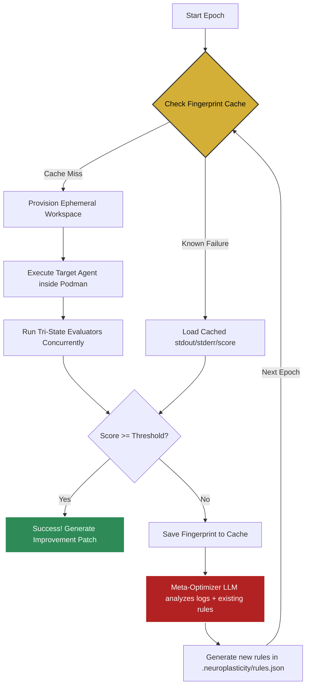
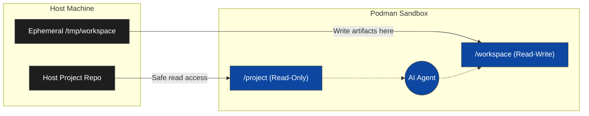
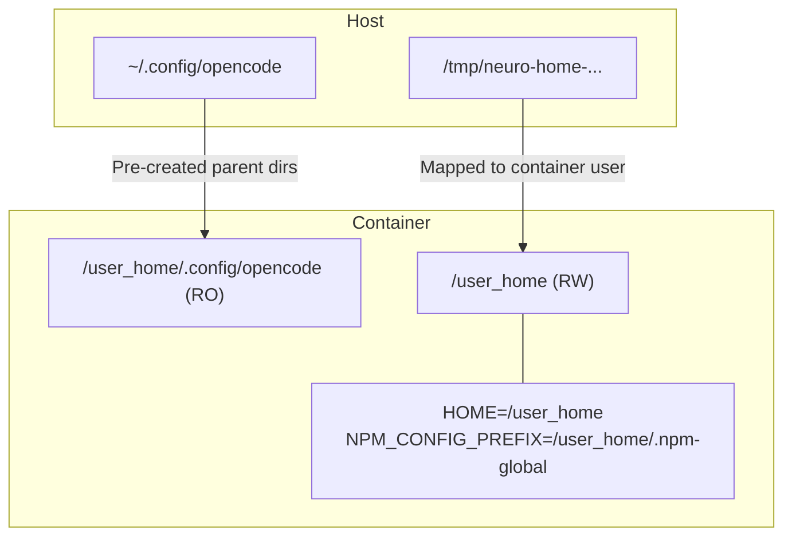

# NeuroPlasticity Architecture

NeuroPlasticity is a highly isolated, self-healing testing environment for AI CLI agents. Its architecture is designed to securely sandbox agent execution, evaluate the results concurrently, and automatically mutate the agent's prompt to fix failures in subsequent epochs.

---

## 1. The Meta-Optimization Loop & Fast-Path Cache

At the core of NeuroPlasticity is the evaluation and optimization loop. If an agent fails to accomplish its task, the orchestrator feeds the `stderr` and evaluation results to an embedded Meta-Optimizer LLM. 

To save immense amounts of compute time (and LLM tokens), NeuroPlasticity v1.0.1 introduces the **Deterministic Fingerprint Cache**. Before spinning up a 120-second container, it hashes the entire test configuration. If that exact configuration previously failed, it skips execution and instantly feeds the cached logs back to the optimizer to force a new breakthrough rule.



---

## 2. Hybrid Workspace (Zero-Copy Architecture)

Historically, testing agents required deep-copying the entire host repository to prevent accidental corruption. This was prohibitively slow for large codebases. NeuroPlasticity introduces the **Hybrid Workspace**.

Instead of copying files, the host repository is mounted into the container as **Read-Only**. The agent is provided a separate, ephemeral scratch directory mounted as **Read-Write**.



**Benefits:**
*   **Absolute Host Safety:** The agent physically cannot delete or corrupt the user's host codebase.
*   **Instant Boot:** Zero file copying means the sandbox boots in milliseconds.

---

## 3. Zero-Config Auth & UID Sandboxing

Agents like `opencode` and `claude-code` require OAuth tokens to communicate with their LLM providers. Instead of forcing users to implement complex headless OAuth flows inside the sandbox, NeuroPlasticity uses **Zero-Config Auth**.

Host configuration directories (like `~/.config/opencode`) are mounted as Read-Only into the container. However, mapping UIDs via Podman's `--userns=keep-id` can cause `EACCES` permission errors when agents try to write to their home directory (e.g., `npm install -g`). 

To solve this, NeuroPlasticity dynamically injects an ephemeral `/user_home` directory.



---

## 4. Zero-Dockerfile JIT Setup & Timeouts

To avoid maintaining dozens of custom Dockerfiles for different agents, NeuroPlasticity uses standard, minimalistic base images (e.g., `node:20-slim` or `python:3.12-slim`). The agent is installed Just-In-Time (JIT) using the `setup_script` array.

To protect host CI resources from hanging, all container executions are wrapped in asynchronous `tokio` timeouts (default 120s) with active `SIGTERM` and `SIGINT` trapping. If an agent (or reasoning LLM) hangs, the orchestrator forcefully kills the orphaned Podman container before exiting.

---

## 5. Tri-State Evaluators (Massively Parallel)

Evaluating the output of an AI agent is notoriously difficult. NeuroPlasticity solves this with **Tri-State Evaluators**.

Every evaluator defined in `plasticity.json` is spawned as an asynchronous `tokio` task, meaning **all tests run concurrently**. Grading an epoch takes only as long as your single slowest test.

```mermaid
flowchart TD
    Eval[Tri-State Evaluators run concurrently via futures::join_all]
    
    Eval -->|type: host_bash| HB[Host Bash]
    HB -.-> HBD[Fast, lightweight POSIX shell commands.<br>Runs directly on the host machine.<br><i>e.g., checking if a file exists.</i>]
    
    Eval -->|type: container| Cont[Isolated Container]
    Cont -.-> ContD[Spins up a dynamic ephemeral container.<br>Mounts workspace as Read-Only.<br><i>e.g., Heavy AST parsers, PyTest, Node.js scripts.</i>]
    
    Eval -->|type: llm| L[Embedded LLM]
    L -.-> LD[Feeds the document to local llama.cpp.<br>Prompt-based qualitative grading (PASS/FAIL).<br><i>e.g., Checking tone, pronouns, structural intent.</i>]
```

### The LLM Semaphore
Because executing 5 LLM evaluators simultaneously using local `llama.cpp` would instantly OOM crash a machine, NeuroPlasticity uses an `Arc<Semaphore>`. If `provider == "embedded"`, LLM concurrency is strictly limited to 1 (queueing safely). Cloud providers (GitHub, OpenAI) scale up to 10 concurrent requests to maximize speed.

---

## 6. Global Model Caching (Offline-First)

When the `embedded-llm` feature is active, NeuroPlasticity runs entirely offline using `llama.cpp`. To respect the user's disk space, it does not blindly download 5GB GGUF models.

Instead, the Rust engine scans universally accepted POSIX model caches across the system before attempting a download (`~/.cache/huggingface/hub/`, `~/.ollama/models/blobs/`, etc.). If a compatible model is found, it is mapped directly into memory.
