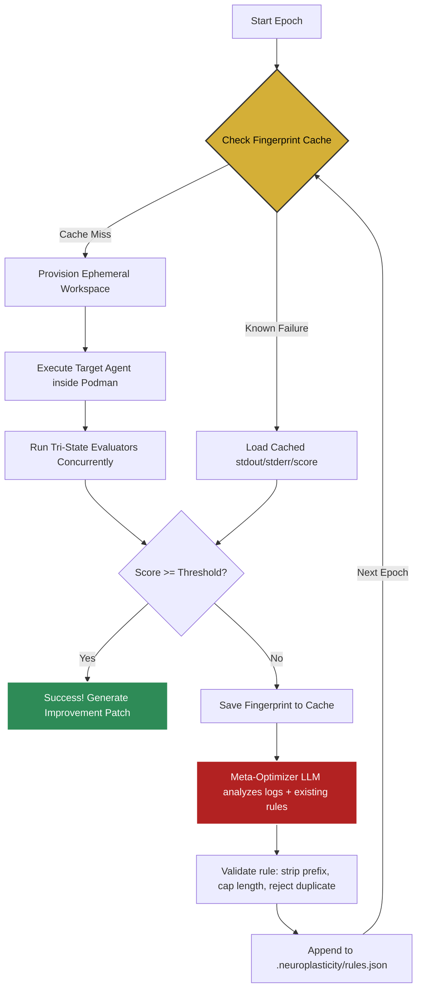
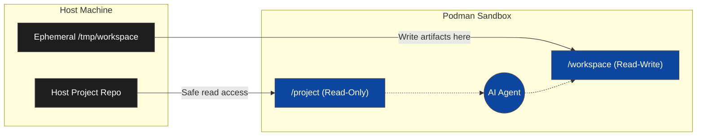
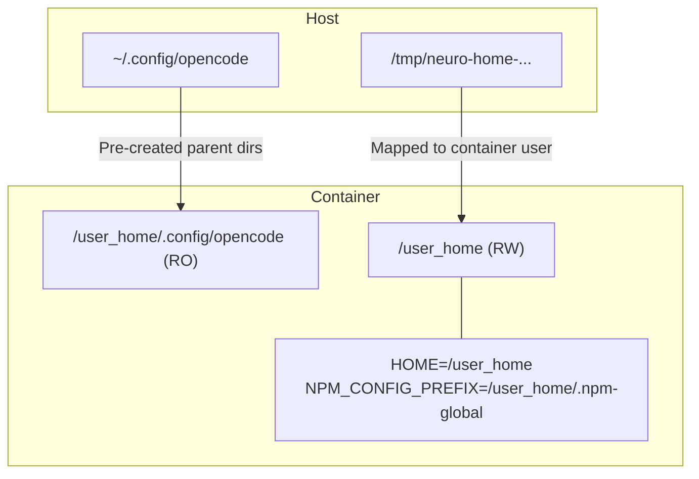
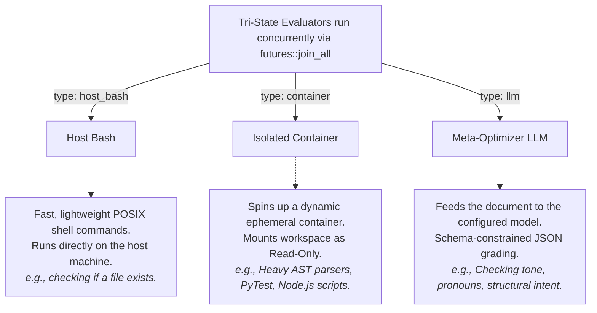

# NeuroPlasticity Architecture

NeuroPlasticity is a highly isolated, self-healing testing environment for AI CLI agents. Its architecture is designed to securely sandbox agent execution, evaluate the results concurrently, and automatically mutate the agent's prompt to fix failures in subsequent epochs.

---

## 1. The Meta-Optimization Loop & Fast-Path Cache

At the core of NeuroPlasticity is the evaluation and optimization loop. If an agent fails to accomplish its task, the orchestrator feeds the `stderr` and evaluation results to an embedded Meta-Optimizer LLM. 

To save immense amounts of compute time (and LLM tokens), NeuroPlasticity introduces the **Deterministic Fingerprint Cache**. Before spinning up a 120-second container, it hashes the entire test configuration. If that exact configuration previously failed, it skips execution and instantly feeds the cached logs back to the optimizer to force a new breakthrough rule.

The hash covers the agent command, manifest name, `meta_llm.provider`, `meta_llm.model`, `meta_llm.base_url`, the serialized evaluators, and the current rule state. Field boundaries are length-prefixed so two different configurations cannot collide by concatenation. Including the provider and base URL matters because only *failures* are cached: the same model name on a different backend is a different grader, and replaying its cached verdict would poison the optimization loop.

### Rule Validation

A rule generated by the Meta-Optimizer is persisted into `rules.json` and injected into the agent's prompt on every subsequent epoch, so it is treated as code, not as prose. Before it is written, it is stripped of any `Rule:` prefix, markdown fencing, and stray quoting, rejected if empty or longer than 400 characters, and rejected if it duplicates an existing rule. A model that fails to produce a usable rule aborts the run with a diagnostic rather than appending garbage to the constraint set.

```mermaid
graph TD
    A[Start Epoch] --> B{Check Fingerprint Cache}
    B -- Known Failure --> C[Load Cached stdout/stderr/score]
    B -- Cache Miss --> D[Provision Ephemeral Workspace]
    D --> E[Execute Target Agent inside Podman]
    E --> F[Run Tri-State Evaluators Concurrently]
    
    F --> G{Score >= Threshold?}
    C --> G

    G -- Yes --> H[Success! Generate Improvement Patch]

    G -- No --> I[Save Fingerprint to Cache]
    I --> J[Meta-Optimizer LLM analyzes logs + existing rules]
    J --> K[Validate rule: strip prefix, cap length, reject duplicate]
    K --> L[Append to .neuroplasticity/rules.json]
    L --> |Next Epoch| B

    style H fill:#2e8b57,stroke:#fff,stroke-width:2px,color:#fff
    style J fill:#b22222,stroke:#fff,stroke-width:2px,color:#fff
    style B fill:#d4af37,stroke:#333,stroke-width:2px,color:#000
```

---

## 2. Hybrid Workspace (Zero-Copy Architecture)

Historically, testing agents required deep-copying the entire host repository to prevent accidental corruption. This was prohibitively slow for large codebases. NeuroPlasticity introduces the **Hybrid Workspace**.

Instead of copying files, the host repository is mounted into the container as **Read-Only**. The agent is provided a separate, ephemeral scratch directory mounted as **Read-Write**.

```mermaid
flowchart LR
    subgraph Host Machine
        Repo[Host Project Repo]
        Scratch[Ephemeral /tmp/workspace]
    end

    subgraph Podman Sandbox
        P_mnt["/project (Read-Only)"]
        W_mnt["/workspace (Read-Write)"]
        Agent((AI Agent))
    end

    Repo -- "Safe read access" --> P_mnt
    Scratch -- "Write artifacts here" --> W_mnt
    P_mnt -.-> Agent
    Agent -.-> W_mnt

    classDef host fill:#1e1e1e,stroke:#4a4a4a,color:#fff;
    classDef sandbox fill:#0d47a1,stroke:#4a4a4a,color:#fff;
    
    class Repo,Scratch host;
    class P_mnt,W_mnt,Agent sandbox;
```

**Benefits:**
*   **Absolute Host Safety:** The agent physically cannot delete or corrupt the user's host codebase.
*   **Instant Boot:** Zero file copying means the sandbox boots in milliseconds.

---

## 3. Zero-Config Auth & UID Sandboxing

Agents like `opencode` and `claude-code` require OAuth tokens to communicate with their LLM providers. Instead of forcing users to implement complex headless OAuth flows inside the sandbox, NeuroPlasticity uses **Zero-Config Auth**.

Host configuration directories (like `~/.config/opencode`) are mounted as Read-Only into the container. However, mapping UIDs via Podman's `--userns=keep-id` can cause `EACCES` permission errors when agents try to write to their home directory (e.g., `npm install -g`). 

To solve this, NeuroPlasticity dynamically injects an ephemeral `/user_home` directory.

```mermaid
flowchart TD
    subgraph Host
        Config["~/.config/opencode"]
        EphHome["/tmp/neuro-home-..."]
    end

    subgraph Container
        CHome["/user_home/.config/opencode (RO)"]
        CState["/user_home (RW)"]
        Env["HOME=/user_home<br>NPM_CONFIG_PREFIX=/user_home/.npm-global"]
    end

    Config -- "Pre-created parent dirs" --> CHome
    EphHome -- "Mapped to container user" --> CState
    CState --- Env
```

---

## 4. Zero-Dockerfile JIT Setup & Timeouts

To avoid maintaining dozens of custom Dockerfiles for different agents, NeuroPlasticity uses standard, minimalistic base images (e.g., `node:20-slim` or `python:3.12-slim`). The agent is installed Just-In-Time (JIT) using the `setup_script` array.

To protect host CI resources from hanging, all container executions are wrapped in asynchronous `tokio` timeouts (default 120s) with active `SIGTERM` and `SIGINT` trapping. If an agent (or reasoning LLM) hangs, the orchestrator forcefully kills the orphaned Podman container before exiting.

---

## 5. Tri-State Evaluators (Massively Parallel)

Evaluating the output of an AI agent is notoriously difficult. NeuroPlasticity solves this with **Tri-State Evaluators**.

Every evaluator defined in `plasticity.json` is spawned as an asynchronous `tokio` task, meaning **all tests run concurrently**. Grading an epoch takes only as long as your single slowest test.

```mermaid
flowchart TD
    Eval[Tri-State Evaluators run concurrently via futures::join_all]
    
    Eval -->|type: host_bash| HB[Host Bash]
    HB -.-> HBD[Fast, lightweight POSIX shell commands.<br>Runs directly on the host machine.<br><i>e.g., checking if a file exists.</i>]
    
    Eval -->|type: container| Cont[Isolated Container]
    Cont -.-> ContD[Spins up a dynamic ephemeral container.<br>Mounts workspace as Read-Only.<br><i>e.g., Heavy AST parsers, PyTest, Node.js scripts.</i>]
    
    Eval -->|type: llm| L[Meta-Optimizer LLM]
    L -.-> LD[Feeds the document to the configured model.<br>Schema-constrained JSON grading.<br><i>e.g., Checking tone, pronouns, structural intent.</i>]
```

### LLM Evaluators Return Structured JSON

An `llm` evaluator asks for a single JSON object, `{"verdict": "PASS"|"FAIL", "reason": "..."}`, constrained by a JSON Schema. The verdict is read by key, never by matching the leading characters of the reply — a response of `**PASS** — valid JSON` is a pass, and it would previously have been scored as a failure.

A reply that does not parse as JSON is retried rather than scored, so a rambling or truncated completion cannot become a verdict.

**Infrastructure failures are not agent failures.** If the model endpoint is unreachable, the key is rejected, or the reply cannot be parsed after all retries, the run aborts with a diagnostic. Scoring that as an evaluator failure would let an expired API key drive the optimizer to "fix" an agent that was never broken, and would cache that bogus failure under a fingerprint.

### The LLM Semaphore
Because executing 5 LLM evaluators simultaneously using local `llama.cpp` would instantly OOM crash a machine, NeuroPlasticity uses an `Arc<Semaphore>`. If `provider == "embedded"`, LLM concurrency is strictly limited to 1 (queueing safely). Cloud providers (custom OpenAI-compatible endpoints) scale up to 10 concurrent requests to maximize speed.

---

## 6. Global Model Caching (Offline-First)

When the `embedded-llm` feature is active, NeuroPlasticity runs entirely offline using `llama.cpp`. To respect the user's disk space, it does not blindly download 5GB GGUF models.

Instead, the Rust engine scans universally accepted POSIX model caches across the system before attempting a download (`~/.cache/huggingface/hub/`, `~/.ollama/models/blobs/`, etc.). If a compatible model is found, it is mapped directly into memory.

The candidate list lives in `~/.config/NeuroPlasticity/models.json` as `{ filename, download_url }` entries and is scanned in order, so a model already present in any cache is adopted without a download. The first entry is also the download fallback. Current defaults are sized for CPU-only inference around 16GB RAM, and are restricted to architectures the vendored `llama.cpp` build actually supports — a model whose architecture that build does not recognize will fail to load, so catalog popularity is not a sufficient filter.

### Per-Model Chat Templates

The prompt is assembled with the chat template embedded in the GGUF itself rather than a hardcoded format. A hardcoded template is silently wrong for every non-ChatML model family, which degrades output quality in a way that looks like a bad model rather than a bad prompt. ChatML is used only as a fallback for GGUFs that ship no template.

---

## 7. Provider Routing & Protocol Support

`optimization.meta_llm` is the single place the model API is configured. Two providers are supported:

*   **`embedded`** (default) — in-process `llama.cpp`, fully offline.
*   **`custom`** — any OpenAI-compatible endpoint via `base_url` and `api_key_env`.

The former `github` provider was removed: GitHub Models was retired on 2026-07-30 and nothing token-authenticated replaced it. A manifest still requesting it fails with an explicit message rather than a network error.

### Two Wire Protocols

`custom` speaks both `chat/completions` and `responses`. The style is taken from `api_style`, or inferred from a `base_url` ending in `/responses`. Responses-API output is parsed from the `output[]` array, skipping `reasoning` and tool-call items so only `output_text` is treated as the completion.

### One Request Path, Layered Hardening

Both protocols share a single request loop carrying:

*   **A hard deadline.** async `reqwest` has no default timeout, so a wedged endpoint would otherwise hang the epoch indefinitely.
*   **Bounded retries with backoff** on 429s and 5xx, which cloud providers produce routinely at the higher concurrency limits.
*   **Graceful degradation.** Providers that reject `temperature`, `max_tokens`, or `response_format` are detected from the 400 body and the field is dropped before retrying, so reasoning models and hosts without structured-output support still work.
*   **Explicit failure.** A non-2xx response raises an error carrying the status and body. It is never converted into plausible-looking model output — a swallowed error would be scored as a grader verdict and then cached as a known failure.

Defaults favor reproducibility: `temperature` is `0.0` so graders do not flap between runs, and generated rules and verdicts are requested as JSON Schema rather than parsed out of prose.
